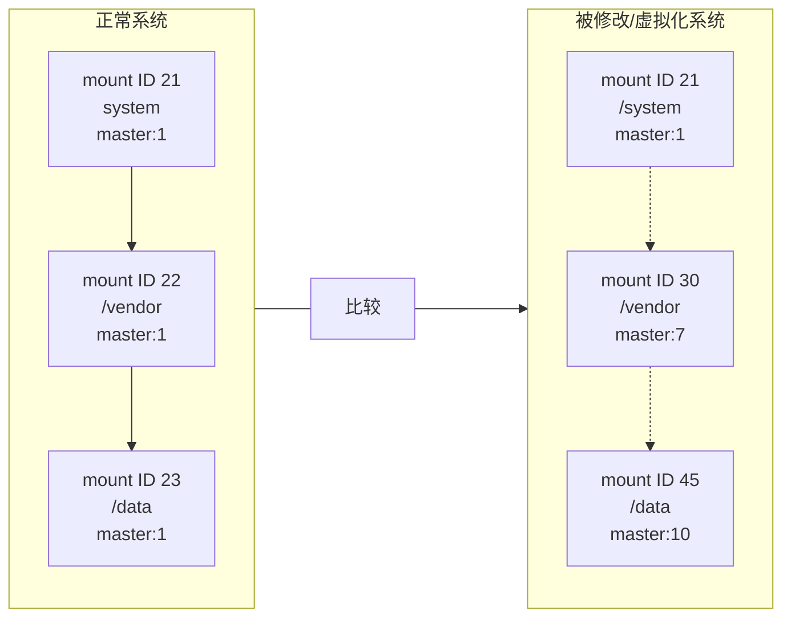
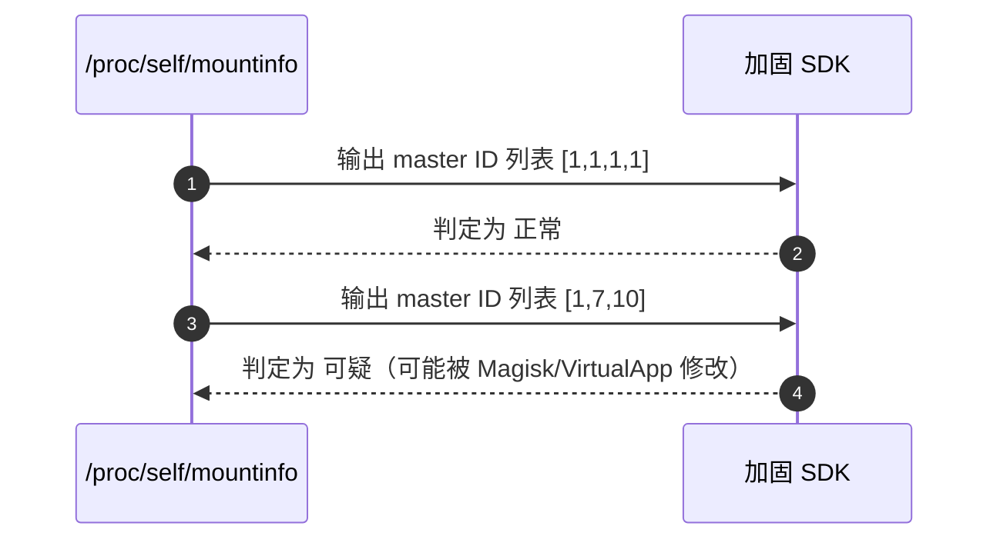

**Android 加固厂商（比如梆梆、安全星、爱加密、腾讯乐固等）用于检测系统环境是否被 Hook、虚拟化或沙箱化的一种“低层反检测手段”**。
下面我们详细分析为什么他们会检查 `/proc/self/mountinfo` 中的 **masterid 序号连续性**：

---

## 一、背景：mountinfo 与 masterid

在 Linux（包括 Android）中：

* `/proc/self/mountinfo` 记录了当前进程的挂载点信息；
* 每一行对应一个挂载点，字段中包含：

  ```
  <mount ID> <parent ID> <major:minor> <root> <mount point> ... master:<master ID>
  ```
* `master:<master ID>` 表示这个挂载属于哪个 **mount namespace 的 master peer group**；

  * 这是 **mount namespace 复制层级**的标识；
  * master ID 通常是 **单调递增的整数**，由内核分配；
  * 在正常的 Android 系统中（未被篡改），这些 ID 通常是**连续且有规律的**。

---

## 二、检测逻辑：加固厂商为什么关注它？

### 🧠 加固厂商的目的：

他们要判断应用是否运行在：

* 被篡改的系统；
* Magisk / KernelSU 之类的修改环境；
* VirtualApp、Xposed、太极、LSP 等虚拟沙箱；
* 模拟器或双开环境（多开引擎）；
* 或者被动态 Hook 的隔离进程环境。

这些环境在实现隔离时，往往会对 mount namespace 动手脚。

---

## 三、为什么 masterid 序号会“不连续”

当系统存在以下情况时：

1. **被 Magisk 修改的 mount namespace**

   * Magisk 在 `init` 时重新挂载 `/system`、`/vendor`；
   * 会创建新的 mount peer group；
   * 这导致 `masterid` 序号跳跃（出现不连续的 ID）。

2. **被 VirtualApp / ParallelSpace 等虚拟环境隔离**

   * 它们创建新的 mount namespace；
   * 模拟挂载文件系统；
   * 伪造或拷贝 `/proc/self/mountinfo`；
   * 由于实现不完全或重建顺序不同，会导致 ID 序列混乱。

3. **被 Hook 框架篡改（如 LSPosed、EdXposed）**

   * 这些框架可能通过 `ptrace` 或 `zygote` fork 创建新的 namespace；
   * 内核自动分配 masterid 时不连续。

---

## 四、厂商如何利用这个检测信号

加固 SDK 通常做以下检查：

1. 读取 `/proc/self/mountinfo`；
2. 提取所有 `master:<ID>`；
3. 检查：

   * 是否递增；
   * 是否连续；
   * 是否存在异常跳跃（如 21 → 25 → 33）；
   * 是否过多重复；
   * 是否数量异常（过多或过少）。

如果检测到：

* ID 不连续；
* mount 数量异常；
* `/system`、`/data`、`/vendor` 属于不同的 master；

则可能判定为：

> “系统被修改”、“环境非原生”、“检测到Root/虚拟环境”。

---

## 五、举例说明

| 环境             | masterid 连续性        | 说明                    |
| -------------- | ------------------- | --------------------- |
| 原生 Android 设备  | 连续，如 1,2,3,4,5      | 正常                    |
| Magisk root 系统 | 有跳跃，如 1,2,3,7,10    | 异常（挂载过 system/vendor） |
| VirtualApp 容器  | 不连续且混乱，如 1,5,8,2    | 明显非真实系统               |
| 模拟器            | masterid 分布异常（大量大号） | 可疑环境                  |

---

## 六、加固厂商为什么喜欢这种方法

✅ 优点：

* 无需 root 权限；
* 属于内核态信息，难以伪造；
* 即使 Hook 层被绕过，也能检测出异常；
* 对性能影响几乎为零。

❌ 缺点：

* 某些厂商的 ROM（尤其是 MIUI、鸿蒙）也可能导致 masterid 不连续；
* 因此检测通常与其他信号（SELinux、proc maps、/proc/mounts）组合使用。

---

## 七、小结

| 项目   | 说明                                       |
| ---- | ---------------------------------------- |
| 检查内容 | `/proc/self/mountinfo` 中的 `masterid` 连续性 |
| 检测目的 | 判断是否处于虚拟化/Hook/Root 环境                   |
| 原理   | 非原生 mount namespace 创建或隔离导致 ID 跳跃        |
| 特点   | 系统级信号，难伪造，轻量但有效                          |

---


# `/proc/self/mountinfo` — masterid 连续性检测示意图

下面的图示展示了 **正常（原生）系统** 与 **被修改 / 虚拟化环境** 在 `/proc/self/mountinfo` 中 `master:<ID>` 的典型分布差异，以及加固厂商如何通过该信息判断可疑环境。

---

## 1) 概念速览

* `mount ID`：该挂载点的唯一标识（行首数字）
* `parent ID`：该挂载点的父挂载 ID
* `major:minor`：设备号
* `mount point`：挂载点路径
* `master:<ID>`：挂载点所属的 peer group/master（用于标识 mount namespace 关联）

---

## 2) 示例（真实 `/proc/self/mountinfo` 行样式）

```
23 19 8:1 / /system rw,relatime - ext4 /dev/block/dm-0 rw master:1
24 23 8:2 / /vendor rw,relatime - ext4 /dev/block/dm-1 rw master:1
25 23 8:3 / /data rw,relatime - ext4 /dev/block/dm-2 rw master:1
```

上面示例中 `master:1` 连续且统一，表示这些挂载属于同一组（正常）。

---

## 3) Diagram: 正常系统 vs 虚拟化/修改系统（Mermaid）



---

## 4) 检测流程（简化）

1. 读取 `/proc/self/mountinfo`。
2. 解析每行的 `master:<ID>` 字段，形成 ID 列表（按行顺序）。
3. 检查序列是否：

   * 单一 master ID（如多数关键路径相同）
   * 单调递增且接近连续（没有大跳跃）
   * 没有异常重复/错位
4. 若出现明显跳跃或混乱（例如 1 → 7 → 10），标记为可疑环境。

---

## 5) 可视化：line chart（示意）



---

## 6) 图例与说明

* 实线箭头：表示同一 peer group（同一 master ID）连续挂载关系。
* 虚线箭头：表示不同 master ID，可能是 namespace 隔离或重挂载导致。
* 注意：某些 ROM 或合法的系统更新/分区策略也可能造成不连续，所以实际判定时会结合其它检测信号（如 SELinux 状态、`/proc/self/maps`、已知 Magisk 路径 等）。

---

